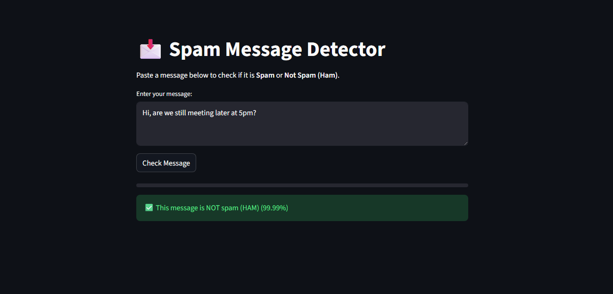
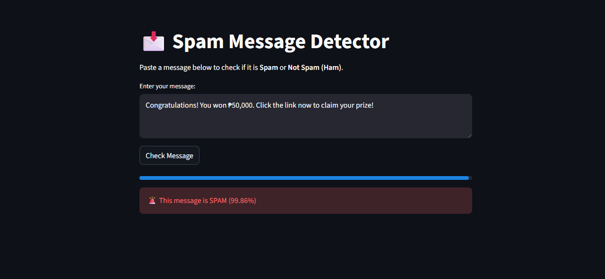

Spam Message Detector

## 🖼️ App Preview

### ✅ Ham (Not Spam)

Normal messages are correctly identified as **Not Spam (HAM)** with a high confidence score.

---

### 🚨 Spam Detection

Spam messages are clearly flagged with a warning indicator and a confidence progress bar.

Spam messages are clearly flagged with a warning indicator and a confidence progress bar.

A Streamlit-based NLP Spam Message Detection application that classifies text messages as Spam or Not Spam (Ham) using Machine Learning.

🔗 Live Demo:
👉 https://nlp-spam-detector.streamlit.app/

✨ Features

🔍 Classifies messages as Spam or Not Spam (Ham)

📊 Displays confidence score (%) for predictions

📈 Visual confidence progress bar

🧠 Uses TF-IDF vectorization for text representation

🤖 Powered by a TensorFlow / Keras trained model

🎨 Clean and minimal Streamlit UI

☁️ Deployed on Streamlit Cloud

🧠 How It Works (Model Overview)

Text Preprocessing

Converts text to lowercase

Removes non-alphabet characters

Removes stopwords using NLTK

Applies Porter Stemming

Feature Extraction

Uses TF-IDF Vectorizer to convert text into numerical features

Prediction

A trained TensorFlow/Keras binary classification model

Outputs a probability score:

> 0.5 → Spam

≤ 0.5 → Not Spam (Ham)

Confidence Display

Prediction confidence shown as a percentage

Visualized using a progress bar for better UX

🛠️ Tech Stack
Python
Streamlit
TensorFlow / Keras
Scikit-learn
NLTK
Joblib
NumPy

How to Run Locally

1️⃣ Clone the repository
git clone https://github.com/ares-coding/spam-app.git
cd spam-app

2️⃣ Install dependencies
pip install -r requirements.txt

3️⃣ Run the app
streamlit run app.py

🧪 Sample Test Messages
✅ Not Spam (Ham)
Hi, are we still meeting later at 5pm?

🚨 Spam
Congratulations! You won ₱50,000. Click the link now to claim your prize!

⚠️ Disclaimer

This application is for educational and demonstration purposes only.
Prediction confidence does not guarantee absolute certainty.

⭐️ If you like this project

Feel free to star the repository and try the live demo!

👤 Author

Ares Coding
GitHub: https://github.com/ares-coding
